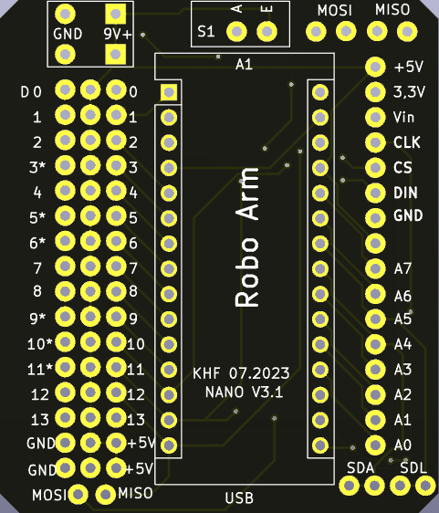

<a name="oben"></a>

<div align="center">

|[:skull:ISSUE](https://github.com/frankyhub/Robo_Arm/issues?q=is%3Aissue)|[:speech_balloon: Forum /Discussion](https://github.com/frankyhub/Robo_Arm/discussions)|[:grey_question:WiKi](https://github.com/frankyhub/Robo_Arm/wiki)||
|--|--|--|--|
| | | | |
||<a href="https://github.com/frankyhub/Robo_Arm/issues">|<a href="https://github.com/frankyhub/Robo_Arm/discussions">|<a href="https://github.com/frankyhub/Robo_Arm/releases">|
|| <a href="https://github.com/frankyhub/Robo_Arm/pulse" alt="Activity">| <a href="https://github.com/frankyhub/Robo_Arm/graphs/traffic">  |<a href="https://github.com/frankyhub?tab=stars"> |
</div>


# Robo Arm Montage Anleitung


## Story:

Diese Anleitung beschreibt den Aufbau eines Robo Arm aus 3mm Sperrholz mit einem Arduino NANO. Die Gelenke der Greifarme werden mit Servo-Motore angetrieben, die Ansteuerung erfolgt über einen Arduino NANO und vier Potis. Optional ist eine Ansteuerung über eine APP und die Drehwinkelanzeige mit einen OLED-Display möglich.

---

## Stückliste:

Das benötigen wir für den Robo Arm:

| Anzahl | Bezeichnung | 
| -------- | -------- | 
| 1        | Sperrholzplatte 3mm x 600x300      |
| 4       | Digital Servo mg996r Metallgetriebe      | 
| 1      | Arduino NANO      | 
| 1       | NANO Shield      | 
| 4       | Potis 10k     | 
| 1       | 50cm Litze       | 
| 4       | Platinenstecker 3pol)        |
| 1       | Steckenetzteil 5V, alternativ: 1x18650 Akku mit Case       |
| 5      | M2 x 10 Schrauben    | 
| 5      | M2 Mutter      | 
| 4      |M2,5 x 10 Schrauben       | 
| 12      |M3 x 10 Schrauben     | 
| 1      | M3 x 20 Schraube      | 
| 5      | M3 Mutter    | 
| 5  | M3 Mutter selbstsichernd   |
| 1  |  M3 x 30 Abstandshalter  |
| 1  |  M3 x 40 Abstanshalter  |
| 1  |  Axialkugellager 51108 40x60x13 mm  |
| 1  |  3D-Druckteile  |
| 2  |  Lasercutter-Teile  |


---

## Robo Arm Montage - Gesamtansicht


---

## Drehteller Montage


---

## Axiallager Montage


---

## Gelenkarm Montage


---

## Greifer Montage


---

## Programmieren

Programmiere jetzt den Robo Arm in Tinkercad, teste dein Programm
und lade dann das Programm in den Microcontroller

---

## Robo Arm Programm


```C++
// C++ code
//
#include <Servo.h>

int Poti1 = 0;
int Winkel1 = 0;

int Poti2 = 0;
int Winkel2 = 0;

int Poti3 = 0;
int Winkel3 = 0;

int Poti4 = 0;
int Winkel4 = 0;


Servo servo_11;
Servo servo_10;
Servo servo_9;
Servo servo_6;

void setup()
{
  pinMode(A1, INPUT);
  servo_11.attach(11, 500, 2500);
  
  pinMode(A2, INPUT);
  servo_10.attach(10, 500, 2500);
  
  pinMode(A3, INPUT);
  servo_9.attach(9, 500, 2500);
  
  pinMode(A4, INPUT);
  servo_6.attach(6, 500, 2500);
}

void loop()
{
  Poti1 = analogRead(A1);
  Winkel1 = map(Poti1, 0, 1023, 0, 180);
  servo_11.write(Winkel1);
  
  
  Poti2 = analogRead(A2);
  Winkel2 = map(Poti2, 0, 1023, 0, 180);
  servo_10.write(Winkel2);  
  
  Poti3 = analogRead(A3);
  Winkel3 = map(Poti3, 0, 1023, 0, 180);
  servo_9.write(Winkel3);
  
  Poti4 = analogRead(A4);
  Winkel4 = map(Poti4, 0, 1023, 120, 180);
  servo_6.write(Winkel4); 
  
  
  delay(50); // Wait for 50 millisecond(s)
}

```

---

## Verdrahten

Verdrahte die Bauteile mit dem [NANO-Shield](https://github.com/frankyhub/KiCad-Shield/tree/main/NANO_Robo_Arm)

+ Poti Drehen = A1;    
+ Poti Kippen = A2; 
+ Poti Heben = A3; 
+ Poti Greifen = A4;    

+ Servo Greifarm = 6*
+ Servo Drehteller = 9*
+ Servo Kippen = 10*
+ Servo Heben = 11*





---

## Montage im Potigehäuse

Montiere die Bauteile in das Lasercutter-Gehäuse


---

Fertig!

---

<div style="position:absolute; left:2cm; ">   
<ol class="breadcrumb" style="border-top: 2px solid black;border-bottom:2px solid black; height: 45px; width: 900px;"> <p align="center"><a href="#oben">nach oben</a></p></ol>
</div>  

---
